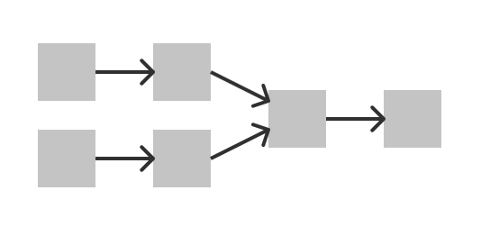
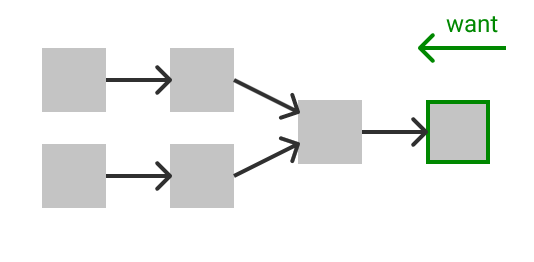
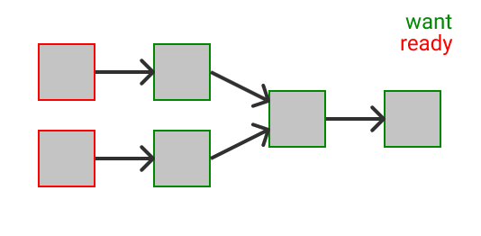
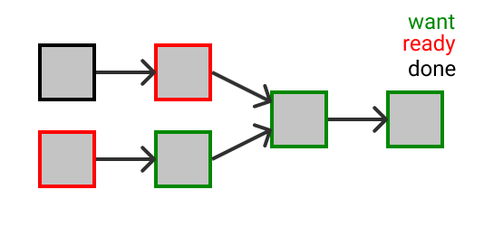
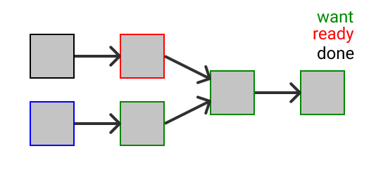

# Design notes

## Build states

While building, we have a bunch of `Build` objects that represent individual
build steps that go through a series of states. Here I give a picture about how
those states work.

Imagine a hypothetical build, represented here by a series of boxes with arrows
representing outputs. n2 models both builds and files in its graph because build
steps may produce more than one output, so it's more complex than this, but it
will do for this discussion. Builds start in the `Unknown` state, just a default
state shown here in gray.

The user requests bringing some build up to date which we mark by the `Want`
state, and traverse the dependencies backwards to mark all inputs also as
`Want`.

Any build that doesn't depend on another build is marked `Ready`.

The main loop pops a `Ready` build and examines its inputs/output to judge
whether it needs to be brought up to date. Here, we examined the upper left
build and determined it was already up to date and marked it `Done`.

For each downstream output of that build, we check whether all the inputs to
that output are `Done` and if so, we mark it `Ready`. This makes the build to
the right `Ready`. Note that `Ready` means "ready to be checked for
up-to-date-ness", and is purely a function of which builds we've checked off and
not any on-disk file state.

In the next iteration of the loop we pop the lower left `Ready` and determine it
is out of date. It then moves to state `Queued` and added to the relevant pool.

Concurrently with visiting `Ready` builds, if we have available execution
parallelism, we examine all the pools that have spare depth for any `Queued`
builds and start executing those tasks, moving the build to the `Running` state.
For example, this build might be in the `console` pool, which has `depth=1`
meaning that pool can only run one build step at a time, which means it might
remain `Queued` if we're already running a build in that pool.

And similarly, if any running builds complete, we move them to the `Done` state
and repeat the same logic done above to mark downstream builds `Ready`.

There is more to this. For example there's a `Failed` state, which is used in
builds with the `-k` flag, that lets us keep running even when some build steps
fail. But the above is most of the picture.

## Missing files

What happens if a file referenced in a build rule isn't present?

For the purpose of ordering: a build is "ready" when all dependent builds have
been brought up to date, and that is independent of whether the files are
present or not.

A missing output, after a build runs, is allowed. This is used in build files as
a marker for build rules that want to always run.

Finally, all the checking happens when deciding whether a ready build is dirty:

- A missing dirtying input is an error.
- A missing order-only input is an error unless it's a generated file. (This
  handles the case where there are build rules used for order-only purposes that
  don't write their outputs.)
- A missing discovered input is allowed. (This is the case where you deleted a
  .h but also removed a reference to it from the .c at the same time.)
- A missing output, which otherwise may have been generated by a previous run,
  is allowed.

But if any of those files are missing we call it dirty without bothering to
compute a hash. In this manner we never compute a hash involving any missing
files.

## Parsing

Parsing .ninja files is part of the critical path for n2, because it must be
complete before any other work can be done. Some properties of the n2 parser
that break abstraction to this end:

- There is no separate lexer. Ninja syntax is not really lexer friendly in the
  first place.
- When possible, `$variable` expansions happen as they're encountered, so that
  we don't need to build up a parsed representation of strings and carry around
  variable environments.
- Parsed entities that deal with paths are generic over a `Path` type, and path
  strings are converted to Paths as they are parsed. (In practice the `Path`
  type is `graph::FileId`, but the parsing code isn't aware of this type
  directly.) This (and the previous bullet) allows the parser to reuse a single
  `String` buffer when parsing paths, which is the bulk of what the parser does.

## Unicode

Ninja
[was intentionally "encoding agnostic"](https://ninja-build.org/manual.html#ref_lexer),
which is to say it treated input build files as any byte stream that is ASCII
compatible. In other words, any string of bytes found in a `build.ninja` is
passed verbatim through printing to stdout and to the OS for path operations,
which meant Ninja was compatible with both UTF-8 and other encodings. The intent
is that those other encodings occur on Linuxes, especially in East Asia, and
also it means Ninja doesn't need any specific handling of even UTF-8.

It looks like since my time,
[Ninja on Windows changed its input files to require UTF-8](https://github.com/ninja-build/ninja/pull/1915).
As you can see from the comments on that bug, this area is unfortunately pretty
subtle.

Windows is particularly fiddly not only because its native path representation
is UTF-16 -- which is incompatible with the original byte stream assumption made
by Ninja and which requires conversions -- but further because Ninja needs to
parse the `/showIncludes` output from the MSVC compiler, which is localized. See
the `msvc_deps_prefix` variable in
[the Ninja docs on deps handling](https://ninja-build.org/manual.html#_deps);
there have been lots of bug reports over the years from people with Chinese
output that is failing to parse right due to Windows code page mess.

In any case, n2 doesn't support any of this for now, and instead just follows
Ninja in treating paths as bytes. (n2 doesn't support `/showIncludes` or MSVC at
all yet.)

It's possibly a better design to require input files to always be UTF-8, though
I think I'd want to better understand the `/showIncludes` situation. (The above
Ninja bug observed this was a breaking change in Ninja, too.) Possibly we could
mandate "input files are UTF-8, and if you need something other than UTF-8 in
your `msvc_deps_prefix` it's on you to escape the exact byte sequence you
desire". However, I'm not clear on whether all possible Windows paths are
representable as UTF-8 or if we'd need to go down the WTF-8 route for full
compatibility.

## Tracking build state

While building, we have a bunch of `Build` objects that represent individual
build steps that go through a series of states. To represent these well I went
through a few patterns and eventually came up with a design I'm pretty happy
with.

First, for each `Build` we store its current state. This lets us quickly answer
questions like "is the build id X ready or not?" (You could imagine storing this
directly in the `Build` or in a side HashMap from id to state, but that's an
implementation detail.) We use this for things like tracking whether we've
already visited a given `Build` when doing a traveral of the graph while
loading. This also has the benefit of ensuring a given `Build` is always in
exactly one known state.

Second, we store data structures on the side for states where we care about
having quicker views onto this state. The idea here is that depending on the
particular needs of a given state we can model those needs specially. For
example, we need to be able to grab the next `Ready` build to work on it, so
there's a `VecDeque` holding those, while builds that go into the `Queued` state
queue into separate run pools, and builds that are `Running` are just tracked
with an integer counter on the run pool.
